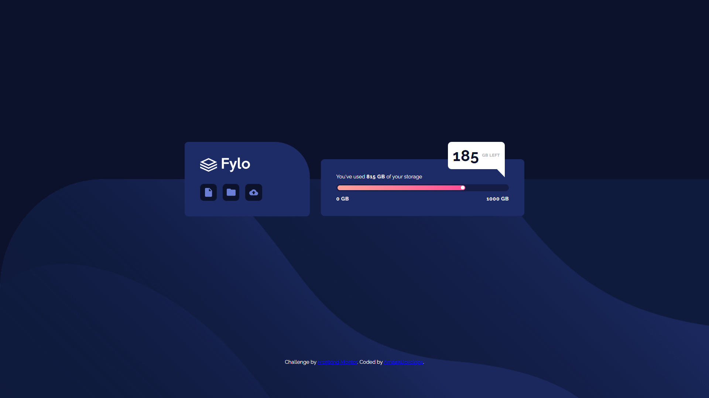

# Frontend Mentor - Fylo data storage component solution

This is a solution to the [Fylo data storage component challenge on Frontend Mentor](https://www.frontendmentor.io/challenges/fylo-data-storage-component-1dZPRbV5n). Frontend Mentor challenges help you improve your coding skills by building realistic projects. 

## Table of contents

- [Overview](#overview)
  - [The challenge](#the-challenge)
  - [Screenshot](#screenshot)
  - [Links](#links)
- [My process](#my-process)
  - [Built with](#built-with)
  - [What I learned](#what-i-learned)
- [Author](#author)

## Overview

### The challenge

Users should be able to:

- View the optimal layout for the site depending on their device's screen size

### Screenshot




### Links

- Solution URL: [Add solution URL here](https://your-solution-url.com)
- Live Site URL: [Add live site URL here](https://your-live-site-url.com)

## My process

### Built with

- Semantic HTML5 markup
- CSS custom properties
- Flexbox
- CSS Grid
- Mobile-first workflow

### What I learned

I acquired profound insights into the domain of CSS grid and flexbox layouts, thereby enhancing my comprehension of their subtleties and optimal utilization. Significantly, I delved deeply into the sphere of custom properties, attaining a comprehensive understanding of their complexities and achieving mastery in their strategic implementation. Moreover, I refined my skills in employing broader and more universally applicable naming conventions. This enabled me to recognize the pivotal role such conventions play in elevating code intelligibility and ensuring its long-term viability. Concurrently, my understanding of pseudo-elements deepened, leading me to a heightened awareness of their significant utility and versatility.

```css
:root {
    --clr-accent-1: hsl(335, 100%, 65%);
    --clr-accent-2: hsl(6, 100%, 80%);
  
    --clr-primary-700: hsl(229, 57%, 11%);
    --clr-primary-600: hsl(230, 55%, 18%);
    --clr-primary-500: hsl(229, 56%, 26%);
    
    --clr-neutral-500: hsl(229, 7%, 55%);
    --clr-neutral-400:  hsl(250, 4%, 70%);
    --clr-neutral-300: hsl(243, 100%, 93%);
    --clr-neutral-200: hsl(317, 100%, 99%);
    --clr-neutral-100: hsl(0, 0%, 100%);
    
    --ff-primary: 'Raleway', sans-serif;
    --fw-regular: 400;
    --fw-bold: 550;
}

.button[data-icon="document"]::before {
    content: '';
    width: 20px;
    height: 24px;
    background-image: url('./images/icon-document.svg');
}

.button[data-icon="folder"]::before {
    content: '';
    width: 24px;
    height: 20px;
    background-image: url('./images/icon-folder.svg');
}

.button[data-icon="upload"]::before {
    content: '';
    width: 24px;
    height: 16px;
    background-image: url('./images/icon-upload.svg');
}

.usage-indicator-bar::before {
    content: '';
    width: 0.625rem;
    height: 0.625rem;
    border-radius: 50vw;
    margin-left: auto;
    background-color: var(--clr-neutral-200);
}

.usage-card::after {
    content: '';
    position: absolute;
    right: 0;
    border-bottom: 1.925rem solid transparent;
    border-right: 1.825rem solid var(--clr-neutral-100);
    margin-top: 5.475rem;
    margin-left: auto;
}
```

## Author

- Frontend Mentor - [@amaandevelops](https://www.frontendmentor.io/profile/amaandevelops)
- Twitter - [@amaandevelops](https://www.twitter.com/amaandevelops)
